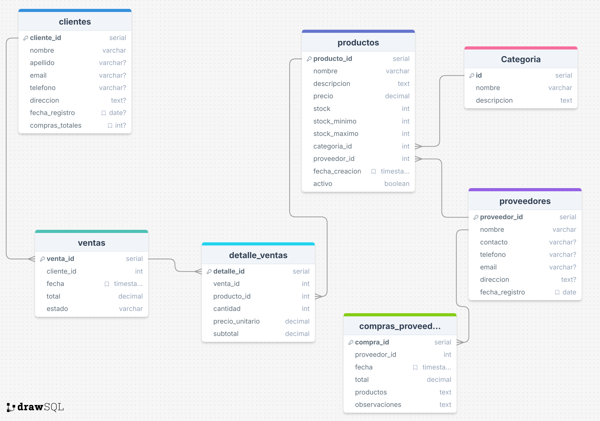

# TechZone

## Próposito del proyecto
El sistema de gestión de TechZone está diseñado para resolver problemas en la administración de:

- Inventario
- Ventas
- Clientes
- Proveedores

El objetivo es automatizar tareas manuales y así aumentar la eficiencia y productividad.

## Funcionalidades
1. Gestión de productos
2. Procesamiento de ventas
3. Análisis de datos
4. Seguimiento de clientes y proveedores

## Modelo ER

## Instrucciones para importar y ejecutar

### 💻Programas instalados
1. PostgreSQL (version 13 en adelante).

### 📮opcionales
- pgAdmin (Interfaz gráfica).
- psql (Línea de comandos).

### Usando psql (Terminal)

1. **Conexión a PostgreSQL**
~~~
psql -h [host] -p [puerto] -d [nombre de base de datos] - [usuario]
~~~

2. **Crear la base de datos (si no existe)**
~~~
CREATE DATABASE techzone;
~~~

3. **Ejecutar archivos SQL**
~~~
psql -U [usuario] -d [nombre de la base de datos]
~~~

### Usando pgAdmin (Interfaz gráfica)

1. **Crea la base de datos**

- Click derecho en Databases -> Create -> Database.
- Ingresa el nombre y guarda.

2. **Ejecutar los scripts**

- Click derecho sobre la base de datos creada.
- Selecciona Query Tool.
- Abre el archivo SQL (Open file).
- Ejecuta con f5 o el botón **Execute script**.

### Descripción de scripts

1. **db.sql**: Estructura de la base de datos. Contiene las tablas necesarias.

2. **Insert.sql**: Datos iniciales para pruebas y operaciones.

3. **queries.sql**: Consultas de información entre tablas.

4. **ProcedureAndFunctions.sql**: Lógica de negocio automatizada.

### Proyecto realizado por Jesús Bustamante estudiante de Campuslands, como parte del módulo de PostgreSQL.🚀